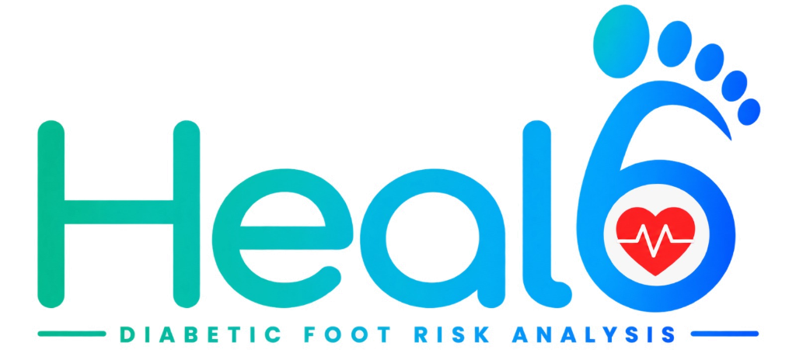

<div align="center">
  
  <h1>Heal6: Clinical-Grade Diabetic Foot Analysis &amp; Triage Engine</h1>
  <p><strong>Edge-to-Cloud Computer Vision Telemetry &amp; Automated SINBAD Staging</strong></p>

  [](https://reactjs.org/)
  [](https://fastapi.tiangolo.com/)
  [](https://pytorch.org/)
  [](https://tailwindcss.com/)
  [](https://www.postgresql.org/)
  [](https://www.docker.com/)
  [](https://hl7.org/fhir/)
  [](https://opensource.org/licenses/MIT)
</div>

<hr />

## 📖 Overview

**Heal6** is an enterprise-grade, multi-platform healthcare suite designed to combat the diabetic foot ulcer (DFU) amputation crisis. By combining a SOTA deep-learning computer vision pipeline with the internationally validated **IWGDF SINBAD** scoring matrix, Heal6 accelerates clinical triage, delivers sub-millimeter wound metrology, and projects 12-week healing trajectories.

The ecosystem bridges the gap between remote patient monitoring and specialist intervention, utilizing a **Patient Edge Application** for guided intake, a high-performance **Doctor Command Center** for verifiable, human-in-the-loop diagnostic execution, and a **React Native mobile app** for cross-platform field deployment.

---

## ✨ Core Ecosystem Features

### 1. 📱 Patient Edge Client (PWA + Mobile)
* **Guided Clinical Self-Assessment:** Translates complex clinical markers into accessible patient actions (e.g., Capillary Refill Pinch Test for Ischemia, Twig/Touch Test for Neuropathy).
* **ArUco Optical Homography:** Integrates standard 25mm ArUco fiducial markers during image capture, eliminating camera tilt and distance distortion — yielding a calibrated **42 px/cm** spatial scale.
* **On-Device Edge Inference:** Runs ONNX-quantized ConvNeXt-V2 and UNet++ models locally via **ONNX Runtime Web** for instant image quality pre-screening before network upload.
* **Offline-First Architecture:** IndexedDB-backed `offlineStorage.js` queues assessments during connectivity loss, syncing automatically on reconnect.
* **Instant Triage Delivery:** Provides patients with immediate, localized risk assessments and automated specialist scheduling.

### 2. 🧠 Industrial PyTorch AI Engine (FastAPI Backend)
* **Task 1 — ConvNeXt-V2 Gatekeeper:** Binary abnormality and bacterial infection triage filter with Grad-CAM XAI heatmap output for clinical explainability.
* **Task 2 — UNet++ (EfficientNet-B4 Backbone):** State-of-the-art, 4-class multi-tissue semantic segmentation isolating Granulation, Slough, Necrotic tissue, and Background periwound. Quantitative tissue area ratios computed from ArUco-calibrated pixel masks.
* **Task 3 — 3D Volumetric Depth Metrology:** Riemann integral-based depth map processing yielding absolute wound volume (cm³) and surface area (cm²) with 3D crater mesh visualization.
* **Thermal Ischemia GAN:** Generative model inferring ischemia perfusion maps from RGB wound images when thermal imaging hardware is unavailable.
* **Multilingual Voice NLP Agent:** Converts spoken patient symptom intake into structured clinical telemetry JSON via an LLM summarizer.
* **Clinical RAG Scribe:** Retrieval-Augmented Generation over the IWGDF 2023 evidence base, auto-drafting treatment recommendations aligned with guidelines.
* **Federated Multi-Center AI:** Differential-privacy-preserving federated learning aggregator for cross-hospital model improvement without raw data sharing.

### 3. 🩺 Doctor Command Center (Clinical Workstation)
* **Live Emergency Master Queue:** Real-time patient telemetry routing via Server-Sent Events (SSE), automatically sorted by descending SINBAD severity.
* **Human-in-the-Loop Validation:** Dual-layer visualization engine layering AI Base64 segmentation masks over raw clinical scans with variable opacity sliders.
* **6-Axis Risk Radar & Trajectory:** Calculates a composite SINBAD score (0-6) and projects an exponential decay healing curve across a 12-week horizon.
* **3D Wound Crater Viewer:** Three.js-powered interactive volumetric depth renderer with cross-section profile plotting.
* **Spatial Debridement AR Guide:** Augmented-reality surgical overlay for wound margin delineation during debridement planning.
* **Enterprise Observability:** Real-time Prometheus APM metrics dashboard with request latency, error rates, and model inference timing.
* **One-Click HL7/FHIR Dispatch:** Securely generates official medical PDFs and interoperable vascular surgery referrals via FHIR R4 bundles.

### 4. 📲 React Native Mobile App
* **Cross-platform:** TypeScript-first Expo app with 13 screens covering the full clinical workflow — Auth, Camera Scan, Clinical Intake, Analysis, Result Summary, Appointments, and Patient History.
* **ArUco Guide Overlay:** Real-time camera viewfinder with ArUco positioning guide for precise marker alignment.
* **i18n Ready:** Multilingual string constants for regional language support.

---

## 🏗️ System Architecture

```text
Heal6_dfu_project/
│
├── 📄 docker-compose.yml              # 4-service container orchestration
├── 📄 .env.example                    # Environment variable template
├── 📄 .env.production                 # Production secrets
├── 📄 pytest.ini                      # Test runner config
├── 📄 aruco_marker_id0.png            # 25mm ArUco calibration marker
│
├── 📁 backend/
│   ├── 📄 main.py                     # FastAPI app entry point + lifespan loader
│   ├── 📄 requirements.txt            # Python dependencies
│   ├── 📄 Dockerfile                  # Backend container image
│   │
│   ├── 📁 app/
│   │   ├── 📁 api/                    # 13 FastAPI Routers
│   │   │   ├── routes_auth.py         # JWT login / token refresh
│   │   │   ├── routes_sinbad.py       # Core SINBAD diagnostic pipeline ⭐
│   │   │   ├── routes_patients.py     # Doctor triage queue
│   │   │   ├── routes_stream.py       # SSE real-time triage streaming
│   │   │   ├── routes_fhir.py         # HL7 / FHIR R4 export
│   │   │   ├── routes_rag.py          # Clinical RAG + IWGDF scribe
│   │   │   ├── routes_federated.py    # Federated multi-center AI
│   │   │   ├── routes_screenings.py   # Mobile patient screenings + PDF
│   │   │   ├── routes_profile.py      # Patient profile management
│   │   │   ├── routes_appointments.py # Clinical appointments
│   │   │   ├── routes_voice.py        # Multilingual voice telemetry
│   │   │   ├── routes_thermal.py      # Thermal ischemia GAN
│   │   │   ├── routes_telemetry.py    # Enterprise observability/metrics
│   │   │   └── routes_xray.py         # X-ray analysis route
│   │   │
│   │   ├── 📁 core/                   # Application configuration
│   │   │   ├── config.py              # Settings + env var loader
│   │   │   ├── database.py            # Async SQLAlchemy engine + session pool
│   │   │   ├── event_bus.py           # Internal event bus
│   │   │   ├── patient_auth.py        # Patient-side JWT auth
│   │   │   ├── security.py            # Password hashing + token creation
│   │   │   └── telemetry.py           # APM / Prometheus metrics recorder
│   │   │
│   │   ├── 📁 crud/                   # DB access layer
│   │   │   ├── crud_assessment.py     # WoundAssessment CRUD ops
│   │   │   └── crud_patient.py        # Patient CRUD ops
│   │   │
│   │   ├── 📁 db/                     # ORM models
│   │   │   ├── base.py                # SQLAlchemy declarative base
│   │   │   ├── patient_db.py          # Mobile SQLite patient DB
│   │   │   └── models/
│   │   │       ├── patient.py         # Patient model
│   │   │       ├── assessment.py      # WoundAssessment model ⭐
│   │   │       ├── validation.py      # PhysicianValidation model
│   │   │       └── reverify.py        # ReverificationRequest model
│   │   │
│   │   ├── 📁 fhir/                   # HL7 / FHIR R4 integration
│   │   │   ├── codes.py               # SNOMED / LOINC code mappings
│   │   │   ├── schemas.py             # FHIR Pydantic schemas
│   │   │   └── serializer.py          # Assessment → FHIR bundle serializer
│   │   │
│   │   ├── 📁 ml_engine/              # AI Inference Modules ⭐
│   │   │   ├── 📁 weights/            # Trained model weights
│   │   │   │   ├── wound_detect_convnext.pth       # ConvNeXt-V2 classifier
│   │   │   │   ├── wound_detect_convnext.onnx      # ONNX export (edge)
│   │   │   │   ├── wound_segment_attention_unet.pth # UNet++ segmentation
│   │   │   │   └── wound_segment_edge_unet.onnx    # ONNX export (edge)
│   │   │   │
│   │   │   ├── inference.py           # ConvNeXt-V2 infection classifier
│   │   │   ├── segmentation_inference.py # UNet++ tissue segmentation ⭐
│   │   │   ├── sinbad_engine.py       # IWGDF SINBAD 0-6 scorer (Pydantic)
│   │   │   ├── depth_metrology.py     # 3D Riemann wound volume/area
│   │   │   ├── calibration.py         # ArUco 25mm homography (42 px/cm)
│   │   │   ├── explainability.py      # Grad-CAM XAI heatmap generator
│   │   │   ├── thermal_gan.py         # Thermal ischemia GAN model
│   │   │   ├── voice_agent.py         # Multilingual NLP telemetry agent
│   │   │   ├── clinical_rag.py        # IWGDF evidence-based RAG scribe
│   │   │   ├── federated_engine.py    # Federated learning aggregator
│   │   │   ├── authenticity_engine.py # Wound image authenticity check
│   │   │   ├── ocr_parser.py          # OCR for prescription parsing
│   │   │   └── export_onnx.py         # Model → ONNX export script
│   │   │
│   │   └── 📁 services/
│   │       └── report_service.py      # PDF diagnostic report generator
│   │
│   ├── 📁 models/
│   │   └── heal6_tissue_sota_best.pth # Best UNet++ checkpoint
│   │
│   ├── 📁 storage/
│   │   ├── 📁 reports/                # Generated clinical PDF reports (H6-*.pdf)
│   │   └── 📁 uploads/                # Patient wound image uploads (H6-*.jpg)
│   │
│   └── 📁 tests/                      # 12 Pytest test modules
│       ├── test_clinical_rag.py
│       ├── test_depth_metrology.py
│       ├── test_explainability.py
│       ├── test_federated.py
│       ├── test_fhir.py
│       ├── test_onnx_export.py
│       ├── test_persistence.py
│       ├── test_security_auth.py
│       ├── test_stream.py
│       ├── test_telemetry.py
│       ├── test_thermal_gan.py
│       └── test_voice_agent.py
│
├── 📁 doctor_web_frontend/            # Clinician Command Center (React + Vite)
│   ├── 📄 vite.config.js
│   ├── 📄 package.json
│   ├── 📄 index.html
│   ├── 📄 nginx.conf                  # NGINX SPA config
│   ├── 📄 Dockerfile
│   │
│   ├── 📁 src/
│   │   ├── App.jsx                    # Root app + routing
│   │   ├── index.css                  # Global styles
│   │   │
│   │   ├── 📁 components/             # 22 React UI Components
│   │   │   ├── LandingPage.jsx        # Auth landing screen
│   │   │   ├── DoctorAuthModal.jsx    # Doctor login modal
│   │   │   ├── MasterTriageQueue.jsx  # Patient triage list (sorted by SINBAD)
│   │   │   ├── PatientCommandCenter.jsx ⭐ # Full case inspection hub
│   │   │   ├── AiResultsColumn.jsx    # AI inference results panel
│   │   │   ├── SinbadTrajectoryCard.jsx # SINBAD radar + trajectory chart
│   │   │   ├── WoundDepthVisualizer3D.jsx # Three.js 3D crater viewer
│   │   │   ├── CraterCrossSectionProfile.jsx # 2D depth cross-section
│   │   │   ├── ImageUploaderCard.jsx  # Drag-drop wound image upload
│   │   │   ├── ClinicalFormCard.jsx   # SINBAD manual form input
│   │   │   ├── CalibrationView.jsx    # ArUco calibration viewer
│   │   │   ├── SpatialDebridementARModal.jsx # AR surgical debridement guide
│   │   │   ├── ThermalIschemiaViewerModal.jsx # Thermal GAN viewer
│   │   │   ├── MultilingualVoiceTelemetryModal.jsx # Voice telemetry UI
│   │   │   ├── ClinicalRAGScribeModal.jsx # IWGDF RAG evidence scribe
│   │   │   ├── FederatedLearningModal.jsx # Federated AI dashboard
│   │   │   ├── FhirExportModal.jsx    # FHIR R4 bundle export
│   │   │   ├── EnterpriseObservabilityModal.jsx # Prometheus metrics
│   │   │   ├── ArchitectureHubModal.jsx # System architecture viewer
│   │   │   ├── WoundRegistryView.jsx  # Patient wound history registry
│   │   │   ├── ReferralModal.jsx      # Surgical referral generator
│   │   │   ├── ReportModal.jsx        # PDF report preview
│   │   │   ├── CriticalAlertBanner.jsx # High-risk alert banner
│   │   │   ├── AnalyticsView.jsx      # Clinical analytics dashboard
│   │   │   ├── Header.jsx             # Top navigation bar
│   │   │   ├── Sidebar.jsx            # Left navigation sidebar
│   │   │   ├── Heal6Logo.jsx          # Brand logo component
│   │   │   ├── CustomCursor.jsx       # Custom cursor animation
│   │   │   └── ThemeToggle.jsx        # Dark/light mode toggle
│   │   │
│   │   ├── 📁 context/
│   │   │   └── ThemeContext.jsx        # Global theme state
│   │   │
│   │   ├── 📁 data/
│   │   │   ├── clinicalCases.js       # Seed patient case data
│   │   │   ├── clinicalImages.js      # Case image references
│   │   │   └── scheduleData.js        # Appointment schedule data
│   │   │
│   │   └── 📁 services/
│   │       ├── api.js                 # Axios API client wrapper
│   │       └── websocket.js           # SSE / WebSocket client
│   │
│   └── 📁 public/
│       └── models/                    # ONNX models for edge inference
│           ├── wound_detect_convnext.onnx
│           └── wound_segment_edge_unet.onnx
│
├── 📁 heal6-patient-app/              # Patient Edge PWA (React + Vite)
│   ├── 📄 vite.config.js
│   ├── 📄 package.json
│   │
│   ├── 📁 src/
│   │   ├── App.jsx                    # Patient app root
│   │   │
│   │   ├── 📁 components/             # 12 Patient UI Components
│   │   │   ├── TopActionBar.jsx       # Top nav + patient info bar
│   │   │   ├── PatientHeader.jsx      # Patient profile header card
│   │   │   ├── DiagnosticVisuals.jsx  # AI result visuals for patient
│   │   │   ├── HealingTracker.jsx     # Healing progress tracker
│   │   │   ├── AppointmentModal.jsx   # Book appointment UI
│   │   │   ├── ScheduleModal.jsx      # View schedule modal
│   │   │   ├── CareModal.jsx          # Care instructions modal
│   │   │   ├── RxModal.jsx            # Prescription viewer
│   │   │   ├── ReverifyModal.jsx      # Request re-verification
│   │   │   ├── ReportFooter.jsx       # PDF report footer
│   │   │   ├── EmergencyAlert.jsx     # Emergency SOS alert
│   │   │   └── ToolkitModal.jsx       # Patient self-care toolkit
│   │   │
│   │   ├── 📁 screens/
│   │   │   └── IntakeScreen.jsx       # Initial wound intake + camera capture
│   │   │
│   │   └── 📁 services/
│   │       ├── api.js                 # Backend API client
│   │       ├── edgeInference.js       # ONNX Runtime Web edge inference
│   │       └── offlineStorage.js      # IndexedDB offline storage
│   │
│   └── 📁 public/
│       ├── models/                    # ONNX models (served as static assets)
│       │   ├── wound_detect_convnext.onnx
│       │   └── wound_segment_edge_unet.onnx
│       ├── Heal6_LOGO.jpeg
│       └── favicon.svg
│
└── 📁 ml_training/                    # Model Training Scripts
    ├── train_task1_wound.py           # ConvNeXt-V2 classifier training
    ├── train_task2_area.py            # UNet area-based segmentation training
    ├── train_task2_sota.py            # UNet++ SOTA segmentation training
    ├── evaluate.py                    # Model evaluation + metrics
    └── 📁 notebooks/                  # Jupyter experiment notebooks
```

---

## 🚀 Getting Started

### Prerequisites
* **Node.js** (v18.0+)
* **Python** (3.10+)
* **CUDA-compatible GPU** (Recommended for <200ms model inference)

### 1. Backend Initialization (FastAPI)
```bash
cd backend
python -m venv venv
source venv/Scripts/activate  # On Windows
# source venv/bin/activate    # On Mac/Linux
pip install -r requirements.txt

# Start the ML Server (Pre-warms models into memory)
uvicorn app.main:app --reload --port 8000
```

### 2. Patient Edge Client
```bash
cd heal6-patient-app
npm install
npm run dev
# Launches at http://localhost:5173
```

### 3. Doctor Command Center
```bash
cd doctor_web_frontend
npm install
npm run dev
# Launches at http://localhost:5173
```

---

## ⚕️ Clinical Standards & Compliance
* **IWGDF 2023 Guidelines:** Fully aligned with the International Working Group on the Diabetic Foot recommendations for classification and triage.
* **SINBAD Scoring System:** Implements the globally validated 6-point matrix (*Site, Ischemia, Neuropathy, Bacterial Infection, Area, Depth*).
* **HL7® FHIR® R4:** Native Release 4 (v4.0.1) Document Bundle serialization with LOINC® and SNOMED CT® standard terminology.
* **Data Security:** Follows zero-retention principles for PII on external models, utilizing AES-256 GCM encrypted telemetry transmission principles.

---

## 👥 The Team
Built with precision for the Smart India Hackathon 2026.

<table align="center">
  <tr>
    <td align="center">
      <a href="https://github.com/kavurubuvanesh">
        <br />
        <sub><b>Buvanesh Kavuru</b></sub>
      </a><br />
      <i>AI/ML & Backend Lead</i>
    </td>
    <td align="center">
      <a href="https://github.com/VivML">
        <br />
        <sub><b>Vivek</b></sub>
      </a><br />
      <i>Frontend Lead & Presentation</i>
    </td>
    <td align="center">
      <a href="https://github.com/Ariba006">
        <br />
        <sub><b>Ariba</b></sub>
      </a><br />
      <i>Edge Client Eng. & Research Lead</i>
    </td>
    <td align="center">
      <a href="https://github.com/Pratyushaghosh148-create">
        <br />
        <sub><b>Pratyusha</b></sub>
      </a><br />
      <i>UI/UX Lead & Analytics</i>
    </td>
    <td align="center">
      <a href="https://github.com/Nishant">
        <br />
        <sub><b>Nishant</b></sub>
      </a><br />
      <i>Quality Assurance</i>
    </td>
    <td align="center">
      <a href="https://github.com/SerialKillr">
        <br />
        <sub><b>Sriram</b></sub>
      </a><br />
      <i>Systems Integration & App Dev</i>
    </td>
  </tr>
</table>

---

## ⚠️ Medical Disclaimer
**Heal6 is an investigational software platform and diagnostic aid.** It utilizes Artificial Intelligence to estimate probabilities of ulceration, ischemia, and infection spread. The AI estimations (including healing timelines) are based on visual data and statistical modeling. It **does not** guarantee specific clinical outcomes and **must not** replace the clinical judgment of a licensed medical professional.
